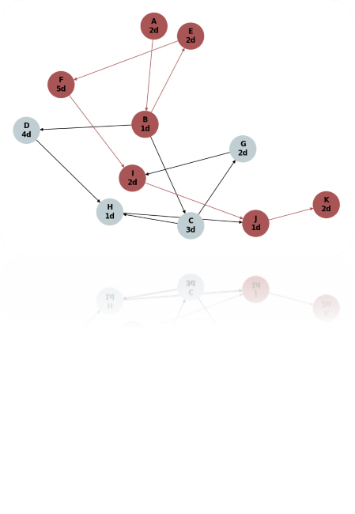

# Critical Path Method (CPM) Project Analyzer

This project, developed as part of the Strategic Programs course at the University of Genoa by Sepehr Mohammady (6117728), implements the Critical Path Method (CPM) to analyze project schedules. It identifies the sequence of activities that determine the project's duration, calculates critical path, and determines activity drag.

## Introduction

The Critical Path Method (CPM) is a project modeling technique used to identify the sequence of activities that determine the project's duration. This script calculates the earliest start (ES), earliest finish (EF), latest start (LS), and latest finish (LF) times for each activity. It identifies the critical path, which is the sequence of activities that must be completed on time for the entire project to be completed on schedule. Any delay in the critical path activities will delay the entire project.

## Key Features

*   **Activity and Dependency Definition:** Activities and their durations are defined, along with dependencies between activities.
*   **Forward and Backward Passes:** Calculates ES, EF, LS, and LF times for each activity.
*   **Critical Path Calculation:** Identifies the critical path by calculating the float for each activity and checking if it is zero.
*   **Drag Calculation:** Calculates the drag for each activity on the critical path.
*   **Visualization:** Generates a visual representation of the project network diagram, highlighting the critical path in red.

## Mathematical Formulas (Brief Overview)

1.  **Earliest Start (ES) and Earliest Finish (EF):**
    *   `ES_i = max(EF_j)` for all `j` predecessors of `i`
    *   `EF_i = ES_i + Duration_i`
2.  **Latest Finish (LF) and Latest Start (LS):**
    *   `LF_i = min(LS_j)` for all `j` successors of `i`
    *   `LS_i = LF_i - Duration_i`
3.  **Total Float (TF):**
    *   `TF_i = LS_i - ES_i = LF_i - EF_i`
    *   TF_i=LS_i-ES_i=LF_i-EF_i
4.  **Drag:**
    *   Drag is the amount of time that an activity on the critical path adds to the project duration.
    *   `Drag_i = Project Duration - New Project Duration (if activity i's duration is reduced to zero)`

## Technologies Used

*   Python 3.x
*   Matplotlib (for plotting)
*   NetworkX (for graph analysis and visualization)

## Setup and Installation

1.  Clone the repository:
    ```bash
    git clone https://github.com/SepehrMohammady/CPMProjectAnalyzer.git
    cd CPMProjectAnalyzer
    ```
2.  (Recommended) Create and activate a virtual environment:
    ```bash
    python -m venv cpm
    source cpm/bin/activate  # On Windows use `cpm\Scripts\activate`
    ```
3.  Install dependencies:
    ```bash
    pip install -r requirements.txt
    ```

## How to Run

Execute the Python script from the terminal:
```bash
python CPM.py
```

The script will print the activity analysis to the console and display the project network diagram.

## Sample Project Data

The script uses the following predefined project data:
Activity	Description	Duration (days)	Predecessors
A	Define event objectives	2	-
B	Select event date	1	A
C	Book venue	3	B
D	Arrange catering	4	B
E	Send invitations	2	B
F	Confirm RSVPs	5	E
G	Arrange transportation	2	C
H	Set up venue	1	C, D
I	Finalize event schedule	2	F, G
J	Conduct event	1	H, I
K	Post-event follow-up	2	J
Example Output
Console Output (Activity Analysis):

Activity Analysis:
Activity    ES  EF  LS  LF  Float   Drag    Critical
A           0   2   0   2   0       2       Yes
B           2   3   2   3   0       1       Yes
C           3   6   3   6   2       0       No
D           3   7   3   7   4       0       No
E           3   5   3   5   0       2       Yes
F           5   10  5   10  0       2       Yes
G           6   8   6   8   2       0       No
H           7   8   7   8   4       0       No
I           10  12  10  12  0       2       Yes
J           12  13  12  13  0       1       Yes
K           13  15  13  15  0       2       Yes

Critical Path: A -> B -> E -> F -> I -> J -> K

Project Duration: 15.0 days

## Project Network Diagram:



## License

This project is licensed under the MIT License - see the LICENSE file for details.
